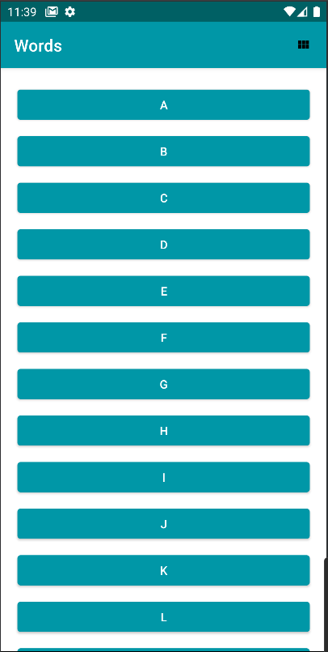
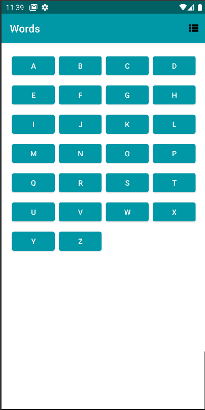
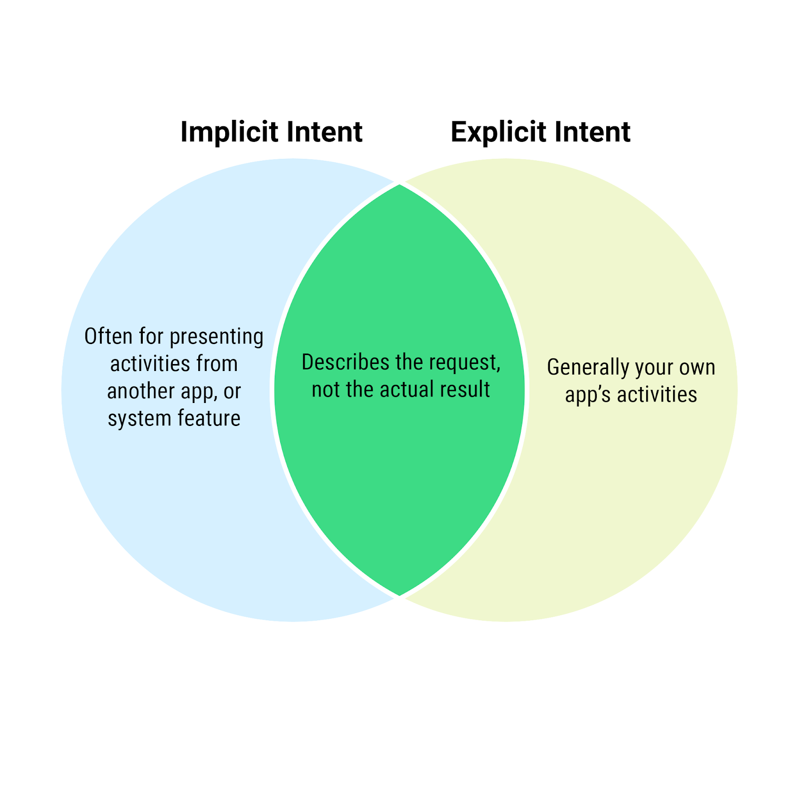

Words App
============

# Description 
Provides a list of the letters in the alphabet, when the user selects a letter, an explicit intent
opens a new screen with a list of words that start with that letter. When the user selects a 
word, an implicit intent uses the dictionary functionality provided by a Google search to display
the definition of the word.

Project sourced from:
- [Activities and Intents](https://developer.android.com/codelabs/basic-android-kotlin-training-activities-intents)
- Starter code for the independent project for [google-developer-training/android-basics-kotlin-words-app](https://github.com/google-developer-training/android-basics-kotlin-words-app/tree/starter).

### Screenshots
Screenshots of the project

#### Homepage view

#### Grid layout

#### Word layout

#### Implicit Intent

## Concepts 

## Intents
Intent is simply a set of instructions
Intent is a property of any activity

### Explicit intent
Explicit intent is highly specific, where you know the exact activity to be launched, often a
screen in your own app.
- showing an activity in your own app
- explicit intent for actions or presenting screens in your own app and are responsible for
the entire process

### Implicit intent
Implicit intent is a bit more abstract, where you tell the system the type of action, such as
opening a link, composing an email, or making a phone call, and the system is responsible for
figuring out how to fulfill the request.
- implicit intents for performing actions involving other apps and rely on the system to determine
the end result
- Your app provides information to the system on what the action should be, and the system figures
out what to do with that action, prompting the user for any additional information as needed.

### Intent Extras
extra is a piece of data, such as a number or string, that is given a name to be retrieved later.
This is similar to passing an argument when you call a function.
- extras property is of type Bundle and provides a way to access all extras passed into the intent.

#### question marks
The reason is that the intent and extras properties are nullable, meaning they may or may not have
a value. Sometimes you may want a variable to be null. The intent property might not actually be
an Intent (if the activity wasn't launched from an intent) and the extras property might not
actually be a Bundle, but rather a value called null. In Kotlin, null means the absence of a value.
The object may exist or it may be null. If your app tries to access a property or call a function
on a null object, the app will crash.To safely access this value, you put a ? after the name. If
intent is null, your app won't even attempt to access the extras property, and if extras is null,
your code won't even attempt to call getString().

### [Common Implicit Intent](https://developer.android.com/guide/components/intents-common) options
* ACTION_VIEW is a generic intent that takes a URI, in your case, a web address
* CATEGORY_APP_MAPS – launching the maps app
* CATEGORY_APP_EMAIL – launching the email app
* CATEGORY_APP_GALLERY – launching the gallery (photos) app
* ACTION_SET_ALARM – setting an alarm in the background
* ACTION_DIAL – initiating a phone call

## companion objects
A companion object is similar to other objects, such as instances of a class. An object
declaration inside a class can be marked with the companion keyword. When only a
single instance of a companion object will exist for the duration of your program, which is why
this is sometimes called the singleton pattern.

## URI
Uniform Resource Identifier
is a string that points to a webpage. A URI is a more general term for the format. All URLs are
URIs, but not all URIs are URLs. Other URIs, for example, an address for a phone number, would
begin with tel:, but this is considered a URN or Uniform Resource Name, rather than a URL. The
data type used to represent both is called URI.

### How to run Script locally

This sample uses the Gradle build system.

To build this project, use the "gradlew build" command or use "Import Project" in Android Studio.

### About the Developer
Jessica Dene Earley-Cha    
[Bio](https://www.jessicadeneearley-cha.com/jessica)   
[Linkedin](https://www.linkedin.com/in/jessicaearley)    